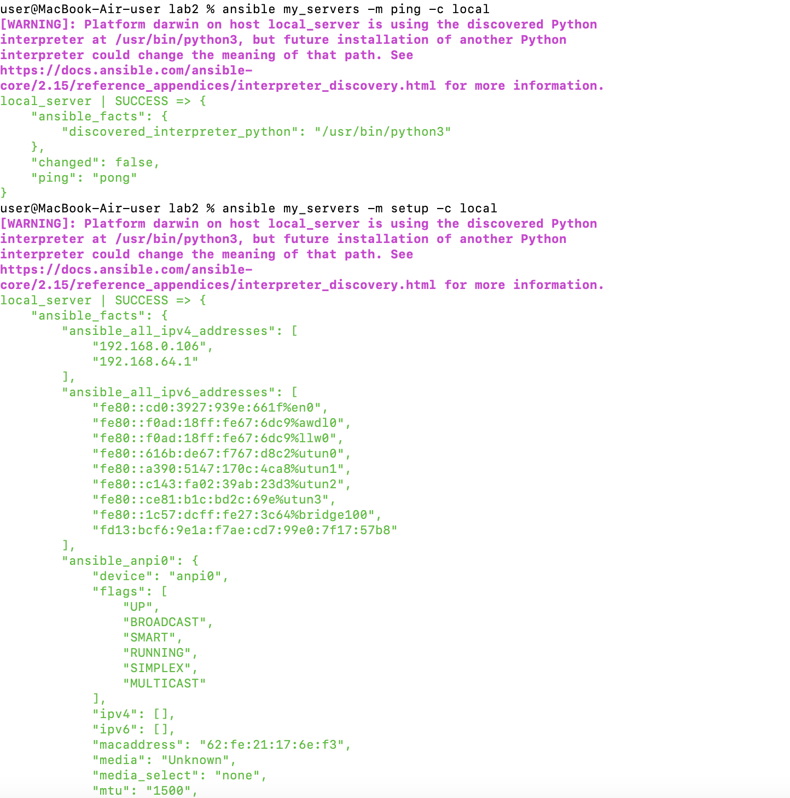
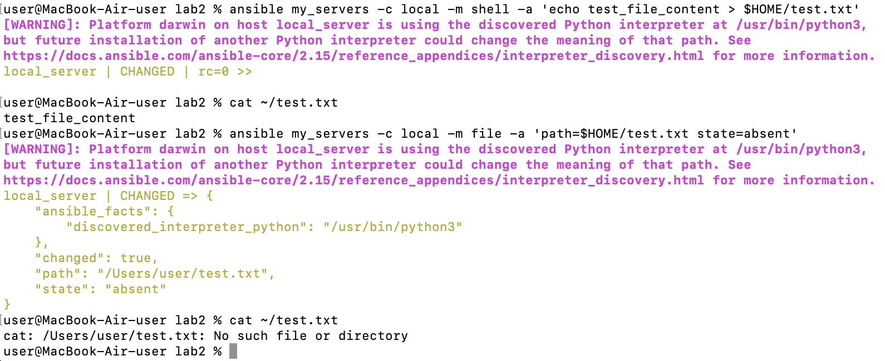
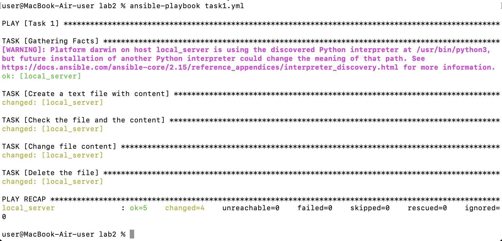

# Отчет по лабораторной работе №2

 ## Часть 1: Установка и настройка Ansible

1. Устанавливаем пакетный менеджер pip для нашего python.
   
2. Устанавливаем ansible: `python3 -m pip install ansible`

3. Создаем базовый конфиг файл, затем папку inventory и в ней файл с хостами.
    <details>
    <summary>Конфиг файл</summary>

    ```toml
    [defaults]
    host_key_checking = false
    inventory = inventory/hosts
     ```

    </details><br>

    <details>
    <summary>hosts</summary>

    ```toml
    [my_servers]
    local_server ansible_host=localhost
     ```

    </details><br>
    

4. Проверяем, что сервер с Ansible подключился к “клиенту”: `ansible my_servers -m ping -c local` и/или `ansible my_servers -m setup -c local`
   <details>
   <summary>Изображение</summary>

   
   </details><br>

5. Пробуем выполнить команду посложнее на нашем клиенте.
   <details>
   <summary>Изображение</summary>

   
   </details><br>


 ## Часть 2: Установка Caddy


 ## Задание
1. Переписать пример с созданием и удалением файла из шага 5 Части 1 с ad-hoc команд на плейбук формат, а так же добавить четвертый шаг - перед удалением поменять содержимое файла на любое другое.
   <details>
   <summary>Изображение</summary>

   
   </details><br>

2.  
