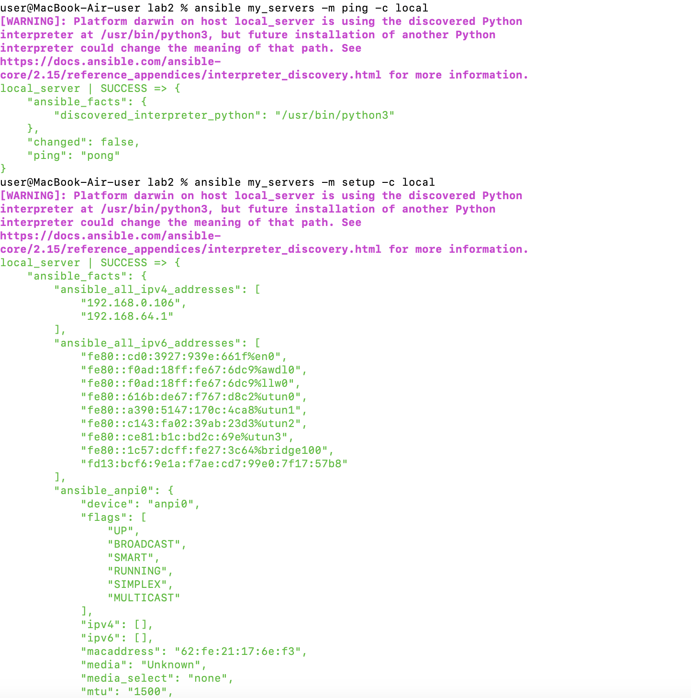
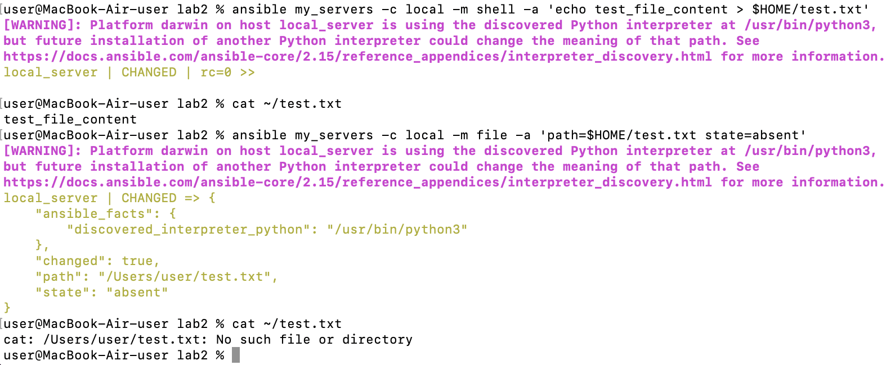
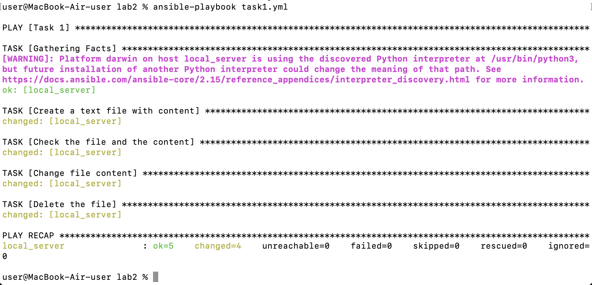
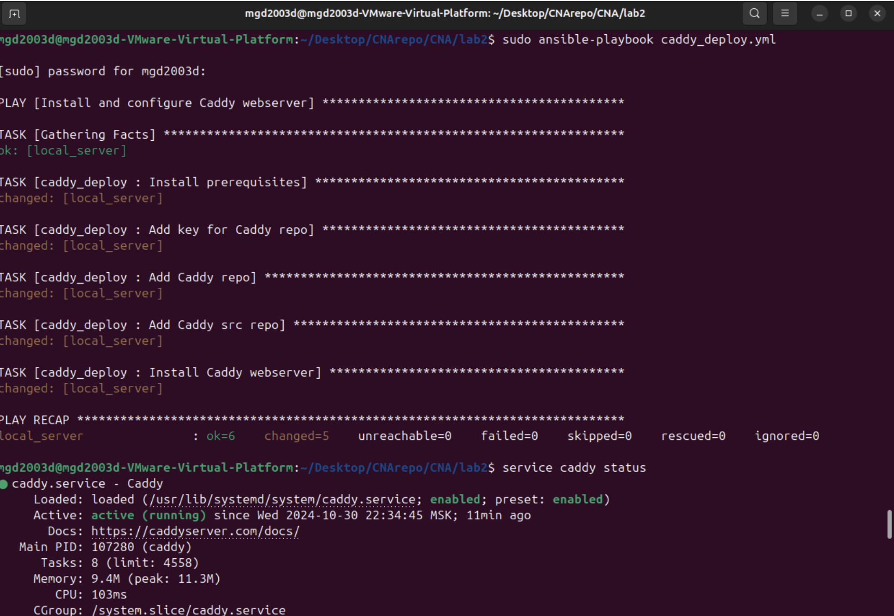

# Отчет по лабораторной работе №2

 ## Часть 1: Установка и настройка Ansible

1. Устанавливаем пакетный менеджер pip для нашего python.
   
2. Устанавливаем ansible: `python3 -m pip install ansible`

3. Создаем базовый конфиг файл, затем папку inventory и в ней файл с хостами.
    <details>
    <summary>Конфиг файл</summary>

    ```toml
    [defaults]
    host_key_checking = false
    inventory = inventory/hosts
     ```

    </details><br>

    <details>
    <summary>hosts</summary>

    ```toml
    [my_servers]
    local_server ansible_host=localhost
     ```

    </details><br>
    

4. Проверяем, что сервер с Ansible подключился к “клиенту”: `ansible my_servers -m ping -c local` и/или `ansible my_servers -m setup -c local`
   <details>
   <summary>Изображение</summary>

   
   </details><br>

5. Пробуем выполнить команду посложнее на нашем клиенте.
   <details>
   <summary>Изображение</summary>

   
   </details><br>


 ## Часть 2: Установка Caddy


 ## Задание
1. Переписать пример с созданием и удалением файла из шага 5 Части 1 с ad-hoc команд на плейбук формат, а так же добавить четвертый шаг - перед удалением поменять содержимое файла на любое другое.
   <details>
   <summary>Изображение</summary>

   
   </details><br>

2.  Инициализация конфигурационного дерева
      ```
      └── caddy_deploy
         ├── defaults
         │   └── main.yml
         ├── files
         ├── handlers
         │   └── main.yml
         ├── meta
         │   └── main.yml
         ├── README.md
         ├── tasks
         │   └── main.yml
         ├── templates
         ├── tests
         │   ├── inventory
         │   └── test.yml
         └── vars
            └── main.yml

      ```
3. Наполнение `roles/caddy_deploy/tasks/main.yml`. Содержит описание шагов, которые будут выполняться в плейбуке
   <details>
   <summary>Содержимое файла</summary>

   ```yml
   ---
   # tasks file for caddy_deploy
   - name: Install prerequisites
   apt:
   pkg:
   - debian-keyring
   - debian-archive-keyring
   - apt-transport-https
   - curl
   - name: Add key for Caddy repo
   apt_key:
   url: https://dl.cloudsmith.io/public/caddy/stable/gpg.key
   state: present
   keyring: /usr/share/keyrings/caddy-stable-archive-keyring.gpg
   - name: add Caddy repo
   apt_repository:
   repo: "deb [signed-by=/usr/share/keyrings/caddy-stable-archive-keyring.gpg] https://dl.cloudsmith.io/public/caddy/stable/deb/debian any-version main"
   state: present
   filename: caddy-stable
   - name: add Caddy src repo
   apt_repository:
   repo: "deb-src [signed-by=/usr/share/keyrings/caddy-stable-archive-keyring.gpg] https://dl.cloudsmith.io/public/caddy/stable/deb/debian any-version main"
   state: present
   filename: caddy-stable
   - name: Install Caddy webserver
   apt:
   name: caddy
   update_cache: yes
   state: present   
   ```

   </details>
<br>

4. Создаю файл конфигурации `caddy_deploy`, где указываю нужные хосты и роли
   <details>
   <summary>Содержимое файла</summary>

   ---
   - name: Install and configure Caddy webserver  # Любое описание
   hosts: my_servers  # хосты из файла inventory/hosts, где будем выполнять наш плейбук
   connection: local  # аналог -c local, но для плейбуков
   become: true
   roles:
      - caddy_deploy  # собственно, роль для выполнения

   </details>
<br>

5. Запускаю плейбук командой `ansible-playbook caddy_deploy.yml`

   