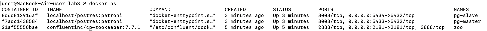
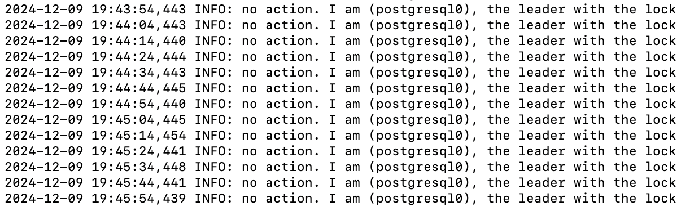
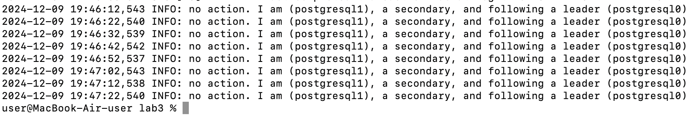
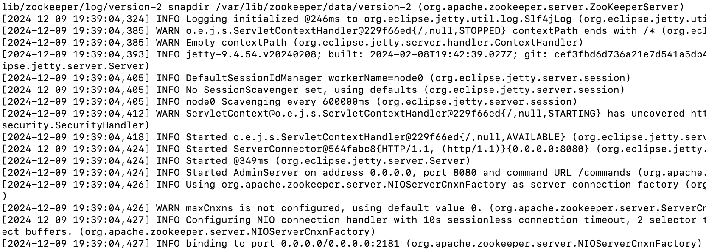

# Отчет по лабораторной работе №3

 ## Часть 1: Поднимаем Postgres

1. Подготавливаем Dockerfile для нашего постгреса. 
   
2. Подготавливаем compose файл, в котором описываем наш деплой постгреса. Так же добавляем в него Zookepeer.

3. Создаем `postgres0.yml` и затем на основе него — `postgres1.yml`

4. Деплоим. Проверяем в логах, что зукипер запустился, и что одна нода постгреса из двух стала лидером/овнером/мастером.
   

   
Изображение

   
   

   details>
   
Изображение

   
   

   details>
   
Изображение

   
   

   details>
   
Изображение

   
   
 
